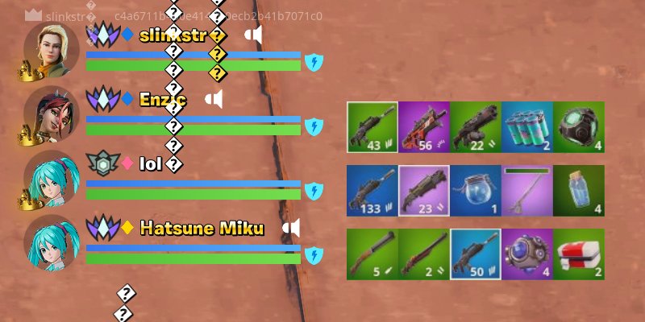

# Fortnite Squad Overlay

Squad gear overlay for Fortnite. Automatically gets current squad as you play and overlays their gear in the top-left corner if they're also running it.

Designed for 100% HUD scale at 1080p or 1440p. Functions with other resolutions/scales, but small rounding errors may degrade the experience.

Downloads ~5MB/hr per squadmate and uploads ~5MB/hr. Doesn't download or upload unless Fortnite is open and you're in a party with other players. 

## Config

Config file is %LOCALAPPDATA%/FortniteOverlay/config.json.

Secret key, upload endpoint, and image location need to be provided by your server host.

## Limitations

* Does not support exclusive fullscreen mode.
* Does not support HDR.
* HUD scale must be set manually.

## [Server Setup](SERVER-SETUP.md)

## Building

Test data is located in a submodule. Run `git submodule init` and `git submodule update` after cloning.